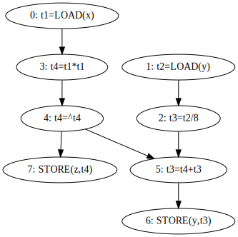

# Final Project Elen 513
Created a multi-core compiler that efficiently translates and optimizes high-level code into low-level instructions, evenly distributing them among processing elements (PEs). Low-level code is simulated and compared against sequential insutrction in order to ensure quality assurance.

## How to Run

Run the following command to execute code.
```
python3 execute.py [source code file name] [memory file name] [core count]
```

For example, to execute the code in "code.txt" with memory values in "mem.txt" and a core count of 3. Run....
```
python3 execute.py code.txt mem.txt 3
```
Executable text files are found and have to be in the 'input/' folder.

### Operation's Handled
| Operation Name | Instruction  | IR                                | Description                                                                                                                 |
| -------------- | ------------ | --------------------------------- | --------------------------------------------------------------------------------------------------------------------------- |
| Load           | t1=LOAD(x);  | ('LOAD','t1','x',())              | Loads value from memory address 'x' into register 't1'.                                                                     |
| Store          | STORE(y,t8); | ('STORE','y','t8',(7,))           | Stores value in register 't8' into memory address 'y'. Line 7 must be excuted first.                                        |
| Add            | t2=t1+4;     | ('ADD', 't2', 't1', '4', (0,))    | Adds value in register t1 with 4 and stores it in register t2. Line 0 must be excuted first    |
| Subtract       | t4=t1-4;     | ('SUB', 't4', 't1', '4', (0,))    | Subtracts value in register t1 with 4 and stores it in register t4. Line 0 must be excuted first                            |
| Multiply       | t9=t5*t2;    | ('MUL', 't9', 't5', 't2', (1, 4)) | Multiplies value in register t9 with value in register t2 and stores it in register t9. Line 1 and 4 must be excuted first. |
| Divide         | t5=t1/2;     | ('DIV', 't5', 't1', '2', (0,)),   | Divides value in register t1 with 2 and stores it in register t5. Line 0 must be excuted first.                             |
| Square Root    | t10=^t9;     | ('SQRT', 't10', 't9', (8,))       | Takes the square root of value in register t9 and stores it in register t10. Line 8 must be excuted first.                  |
| Equal    | t1=10;     | NA *(Constant Propagation)*       | Stores the value 10 in register t1.                  |


## Approach


The Main Code Loop involves 3 Classes: ```Parser()```, ```CodeGen()```, and ```Simulator()```.
```
Main Code Loop
1. Takes input code, memory, core count.
2. Generates DFG and IR from Parser() Class.
3. The CodeGen() Class then uses the IR to distributes instrutions amongst PEs and generates a multi-core and a single-core compiled code. 
4. The Simulator() Class then simulates the cycle-by-cycle insutrction execution for both compiled codes and tests to see if the outputs are correct.
```


### Parser Class

Utilizing code from the 'input/' directory, the system generates an optimized intermediate representation (IR). This optimization process encompasses essential techniques such as dead code elimination, constant folding, and constant propagation.

Main IR creation function ```parse()``` from parser class executes
```
Parser().parse()
1. Generate Instruction Set from input code.
2. Tokenized Instruction Set.
3. Generate Partial IR from instruction set.
4. Generate IR with Dependencies from Partial IR.
5. Remove Duplicate Code, and regenerate new IR.
6. Remove dead code and generate new IR.
7. While constant_folding is True.
   1. Apply Constant Folding.
   2. Apply Constant Propagation.
   3. Regenerate IR with Dependencies from Partial IR.
8. Generate Data Flow Graph and IR.
```


### CodeGen Class
The class efficiently receives the intermediate representation (IR) outputted by the ```parser()```, evenly distributing it among the processing elements, ensuring synchronization, and seamlessly storing the processed data in their respective files.

#### *Distribution Algorithm*
*Swap a task from the most loaded PE to the least loaded PE based off of total cycles*


Main instruction distribution and synchronization function ```generate_compiled_code()``` from CodeGen class executes
```
CodeGen().generate_compiled_code()
1. Create an initial assignment instruction to PEs.
2. Get initial execution times.
3. Check initial wordload imbalance.
4. While new imbance < Current imbalance.
    1. Rebalance workload by swaping tasks between the PE with the highest cycle count time and the PE with lowest cycle time.
    2. Calculate new execution times.
    3. Calculate new imbalance times.
5. Synchronize multi-core compiled code with NOPs so instruction excecute correctly.
6. Generate final compiled code.
```
* *Note: each empty new line in PE_.txt represents a cycle until an instruction is finished.*  

### Simulator Class
Utilizes the compiled code generated by CodeGen() to simulate the execution of each instruction during every cycle. 
```
Simulator().run()
1. Load Compiled Code.
2. While PEs have instructions to run
    1. For every PE, If current instruction is finished, load next instruction and execute. 
    2. Update cycle time.
```

## Files and Directories

### *Input/*
Input directory that contains code.txt, mem.txt, and operation_latency.json.
### *Output/*
Output directory that contains DFG outputs, multi_core_code directory, and single_core_code directory.
### *lib.py*
Source Code that contains the classes Parser(), CodeGen(), and Simulator().
### *execute.py*
Main python file executing Parser(), CodeGen(), and Simulator().
### *debug.ipynb*
Notebook for debuging code.


## Example

### Initial Inputs
Code.txt
```
t1=LOAD(x);
t2=LOAD(y);
t3=t2/8;
t4=t1*t1;
t4=^t4;
t3 = t4+t3;
STORE(y , t3 );
STORE(z , t4 );
```

Mem.txt
```
x=10
y=20
z=30
```
Operational Latency
```
{
    "ADD":1,
    "SUB":1,
    "MUL":4,
    "DIV":8,
    "SQRT":10,
    "LOAD":1,
    "STORE":1
}
```
Core Count: 2


At the end of simulation, we should see 'y=12.5' and 'z=10.0' in the memory.
```
t1=10
t2=20
t3=t2/8 = 20/8 = 2.5
t4=t1*t1 = 10*10 = 100
t4=^t4 = 10
t3 = t4+t3; = 10+2.5 = 12.5
y = 12.5
z = 10
```


### Running Parser()
After executing ```parse()```, 

Optimized IR
```
[('LOAD', 't1', 'x', ()),
 ('LOAD', 't2', 'y', ()),
 ('DIV', 't3', 't2', '8', (1,)),
 ('MUL', 't4', 't1', 't1', (0,)),
 ('SQRT', 't4', 't4', (3,)),
 ('ADD', 't3', 't4', 't3', (2, 4)),
 ('STORE', 'y', 't3', (5,)),
 ('STORE', 'z', 't4', (4,))]
 ```
DFG




### Running CodeGen()

Compiled Distributed Code for both Multi-Core and Single Core.
#### Multi-Core (2)
*PE0*
```
LOAD, t2, y
NOP
NOP
NOP
NOP
SQRT, t4, t4
NOP
STORE, y, t3
```
*PE1*
```
LOAD, t1, x
MUL, t4, t1, t1
DIV, t3, t2, 8
NOP
NOP
ADD, t3, t4, t3
STORE, z, t4
```

#### Single-Core
```
LOAD, t1, x
LOAD, t2, y
DIV, t3, t2, 8
MUL, t4, t1, t1
SQRT, t4, t4
ADD, t3, t4, t3
STORE, y, t3
STORE, z, t4
```

### Running Simulator()
Output for simulating both Multi-Core and Single-Core Code
```
Added Address Value Pairs to Memory
Simulating Single Core Code
Intial Single Core Memory: {'x': 10.0, 'y': 20.0, 'z': 30.0}
"""
Cycle:1,    PE_0: LOAD, t1, x[1],         
Cycle:2,    PE_0: LOAD, t2, y[1],         
Cycle:3,    PE_0: DIV, t3, t2, 8[8],      
Cycle:4,    PE_0: DIV, t3, t2, 8[7],      
Cycle:5,    PE_0: DIV, t3, t2, 8[6],      
Cycle:6,    PE_0: DIV, t3, t2, 8[5],      
Cycle:7,    PE_0: DIV, t3, t2, 8[4],      
Cycle:8,    PE_0: DIV, t3, t2, 8[3],      
Cycle:9,    PE_0: DIV, t3, t2, 8[2],      
Cycle:10,   PE_0: DIV, t3, t2, 8[1],      
Cycle:11,   PE_0: MUL, t4, t1, t1[4],     
Cycle:12,   PE_0: MUL, t4, t1, t1[3],     
Cycle:13,   PE_0: MUL, t4, t1, t1[2],     
Cycle:14,   PE_0: MUL, t4, t1, t1[1],     
Cycle:15,   PE_0: SQRT, t4, t4[10],       
Cycle:16,   PE_0: SQRT, t4, t4[9],        
Cycle:17,   PE_0: SQRT, t4, t4[8],        
Cycle:18,   PE_0: SQRT, t4, t4[7],        
Cycle:19,   PE_0: SQRT, t4, t4[6],        
Cycle:20,   PE_0: SQRT, t4, t4[5],        
Cycle:21,   PE_0: SQRT, t4, t4[4],        
Cycle:22,   PE_0: SQRT, t4, t4[3],        
Cycle:23,   PE_0: SQRT, t4, t4[2],        
Cycle:24,   PE_0: SQRT, t4, t4[1],        
Cycle:25,   PE_0: ADD, t3, t4, t3[1],     
Cycle:26,   PE_0: STORE, y, t3[1],        
Cycle:27,   PE_0: STORE, z, t4[1],        
"""
Final Single Core Memory: {'x': 10.0, 'y': 12.5, 'z': 10.0}


Simulating Multi Core Code
Intial Multi Core Memory: {'x': 10.0, 'y': 20.0, 'z': 30.0}
"""
Cycle:1,    PE_0: LOAD, t2, y[1],         PE_1: LOAD, t1, x[1],         
Cycle:2,    PE_0: NOP[1],                 PE_1: MUL, t4, t1, t1[4],     
Cycle:3,    PE_0: NOP[1],                 PE_1: MUL, t4, t1, t1[3],     
Cycle:4,    PE_0: NOP[1],                 PE_1: MUL, t4, t1, t1[2],     
Cycle:5,    PE_0: NOP[1],                 PE_1: MUL, t4, t1, t1[1],     
Cycle:6,    PE_0: SQRT, t4, t4[10],       PE_1: DIV, t3, t2, 8[8],      
Cycle:7,    PE_0: SQRT, t4, t4[9],        PE_1: DIV, t3, t2, 8[7],      
Cycle:8,    PE_0: SQRT, t4, t4[8],        PE_1: DIV, t3, t2, 8[6],      
Cycle:9,    PE_0: SQRT, t4, t4[7],        PE_1: DIV, t3, t2, 8[5],      
Cycle:10,   PE_0: SQRT, t4, t4[6],        PE_1: DIV, t3, t2, 8[4],      
Cycle:11,   PE_0: SQRT, t4, t4[5],        PE_1: DIV, t3, t2, 8[3],      
Cycle:12,   PE_0: SQRT, t4, t4[4],        PE_1: DIV, t3, t2, 8[2],      
Cycle:13,   PE_0: SQRT, t4, t4[3],        PE_1: DIV, t3, t2, 8[1],      
Cycle:14,   PE_0: SQRT, t4, t4[2],        PE_1: NOP[1],                 
Cycle:15,   PE_0: SQRT, t4, t4[1],        PE_1: NOP[1],                 
Cycle:16,   PE_0: NOP[1],                 PE_1: ADD, t3, t4, t3[1],     
Cycle:17,   PE_0: STORE, y, t3[1],        PE_1: STORE, z, t4[1],        
"""
Final Multi Core Memory: {'x': 10.0, 'y': 12.5, 'z': 10.0}

Final Cycle Count: Single Core 27, Multi-Core 17. Speed Up 1.588
Single Core and Multi Core Memory Equal. Code ran correctly!
```
As we can see, both the Single and Multi core executed correctly with 'y=12.5' and 'z=10.0' while seeing a 1.588 theoretical speedup when using parallelism.